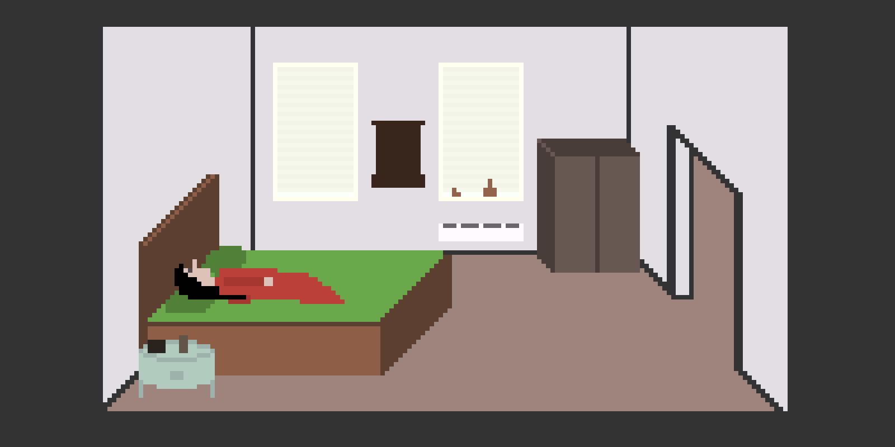
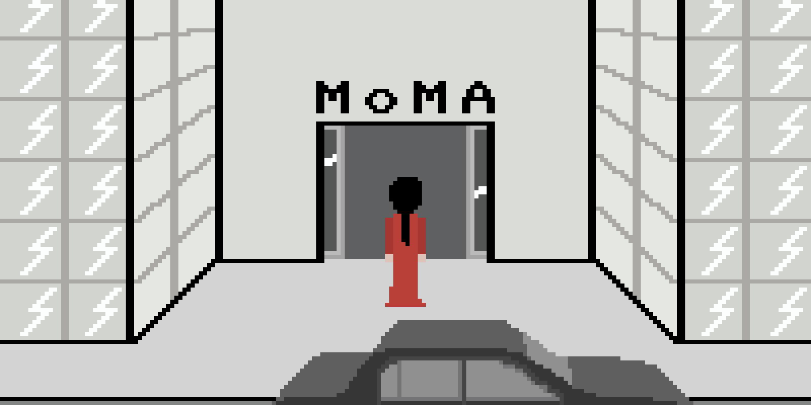
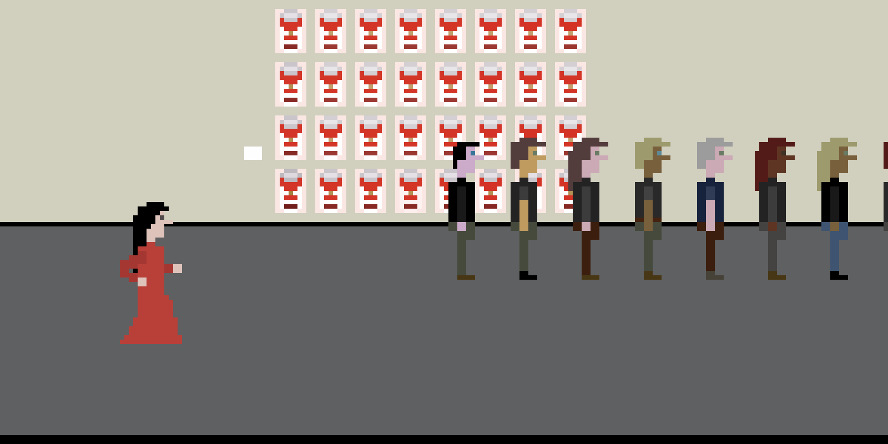
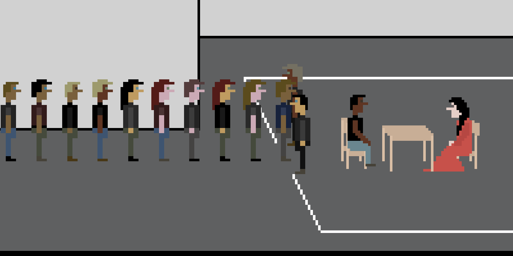
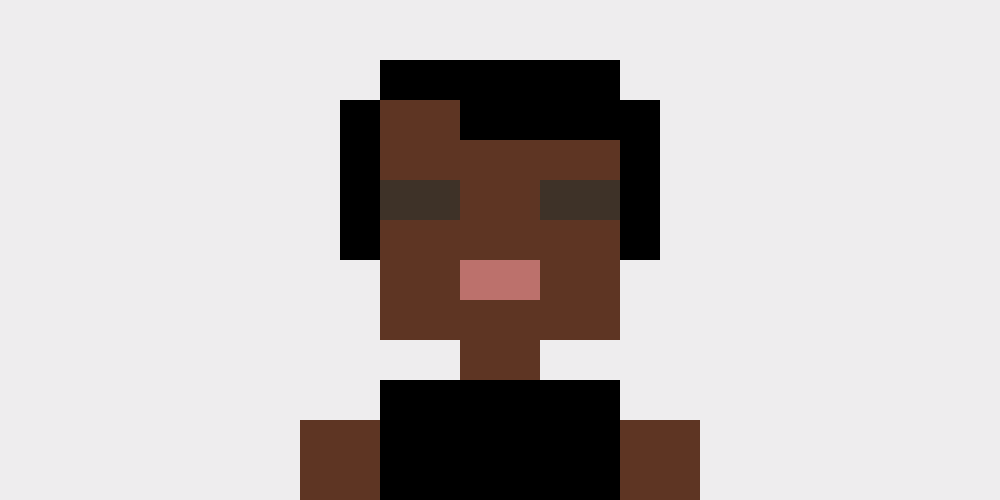

# _The Artist Is Present 2_ Press Kit

_It's happening! Again! The Artist Is Present! You are present! The artist is you! Put on your red dress and sit in the famous chair! Lock eyes with your audience! Be there now!_

#### [Play _The Artist Is Present 2_](https://pippinbarr.github.io/the-artist-is-present-2/)

## The basics

* Developer: [Pippin Barr](http://www.pippinbarr.com/)
* Release: 19 February 2020
* Platform: Browser (desktop)
* Code repository: https://github.com/pippinbarr/the-artist-is-present-2
* Price: $0.00

## Who is this Pippin Barr guy?

Pippin is an experimental game developer who has made games about everything from [Eurovision](http://www.pippinbarr.com/2012/03/27/epic-sax-game/) to [performance art](http://www.pippinbarr.com/2011/09/14/the-artist-is-present/) to [dystopian post-work futures](http://www.pippinbarr.com/games/2017/07/03/it-is-as-if-you-were-doing-work.html). He's an Assistant Professor in the [Department of Design and Computation Arts](http://www.concordia.ca/finearts/design.html) at [Concordia University](http://www.concordia.ca/) in Montréal. He is also the associate director of the [Technoculture, Art, and Games (TAG)](http://tag.hexagram.ca/) Research Centre, which is part of the [Milieux Institute for Arts, Culture, and Technology](http://milieux.concordia.ca/).

## Description

_The Artist Is Present 2_ is the non-awaited sequel to one of my earliest games, [_The Artist Is Present_](http://www.pippinbarr.com/2011/09/14/the-artist-is-present/). The original game put the player in the shoes of a visitor to the Museum of Modern Art, attending the performance _The Artist Is Present_ by Marina Abramovic. There they could wait in a very long queue to have the privilege of sitting opposite the artist, just like the real thing. In the sequel, the roles are reversed and the player is asked to take on the part of Marina Abramovic herself, giving the performance by making silent eye contact with each audience member who comes to sit with them.

## History

I've thought of making _The Artist Is Present 2_ for quite a while. Clearly the idea itself is a simple inversion of the previous game, so it's not hard to think of. In fact, I even mentioned the idea to Marina Abramovic when I had the chance to meet her in Toronto back in 2013, but she said she thought it sounded boring. Fair enough. For whatever reason, I only got around to seriously thinking I'd make it at the end of 2019, and slowly creaked into action to produce it over a couple of months. It doesn't have a particularly dramatic production history because it's a fairly straightforward piece of work, mostly a remix of the original except that it includes material derived from a documentary (also called _The Artist Is Present_!) to help render the apartment that Marina was staying in during the performance period.

_The Artist Is Present 2_ is also another reference point in the detailed process documentation approach called [MDMA](http://www.gamesasresearch.com/mdma). You can read a little about the game's development by reading its [process documentation](https://github.com/pippinbarr/the-artist-is-present-2/blob/master/process/README.md) and by going through its [commit history](https://github.com/pippinbarr/the-artist-is-present-2/commits/master).

## Technology

_The Artist Is Present 2_ was created using [Phaser 3](https://phaser.io), my favorite 2D game library for JavaScript. It makes use of [Colbydude](https://github.com/Colbydude)'s [Phaser 3 Palette Swapping Example](https://github.com/Colbydude/phaser-3-palette-swapping-example) to do recoloring of the audience members so they look different from one another.

## License

_The Artist Is Present 2_ is an open source game licensed under a [Creative Commons Attribution-NonCommercial 3.0 Unported License](http://creativecommons.org/licenses/by-nc/3.0/). You can obtain the source code from its [code repository](https://github.com/pippinbarr/the-artist-is-present-2) on GitHub.

## Features

- Wear the red dress!
- Ride in a chauffeured car!
- Be admired by your audience!
- Meet people's eyes!
- Keep meeting people's eyes!
- Do not stop meeting people's eyes!
- Tears!

### [Trailer](https://www.youtube.com/watch?v=XG8POzg0Rfo)

## Images

  

  

  

  

  

## Press

- Coming soon?

## Additional Links

- [Process documentation of _The Artist Is Present 2_](https://github.com/pippinbarr/the-artist-is-present-2/blob/master/process/README.md)
- [Commit history of _The Artist Is Present 2_](https://github.com/pippinbarr/the-artist-is-present-2/commits/master)

## Credits

- Pippin Barr: design, code, etc.
- Marina Abramović: the original performance

## Contact

* Email: [pippin.barr+press@gmail.com](mailto:pippin.barr+press@gmail.com)
* Website: [www.pippinbarr.com](http://www.pippinbarr.com/)
* Twitter: [@pippinbarr](https://www.twitter.com/pippinbarr)
* Instagram: [@pippinbarr](https://www.instagram.com/pippinbarr)
* Facebook: [Pippin Barr](http://www.facebook.com/pippin.barr)
