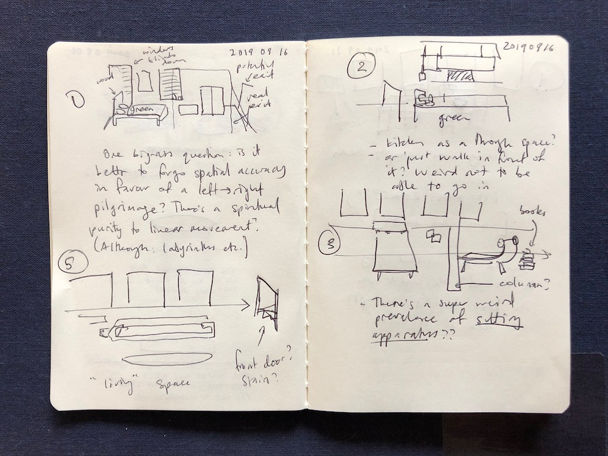
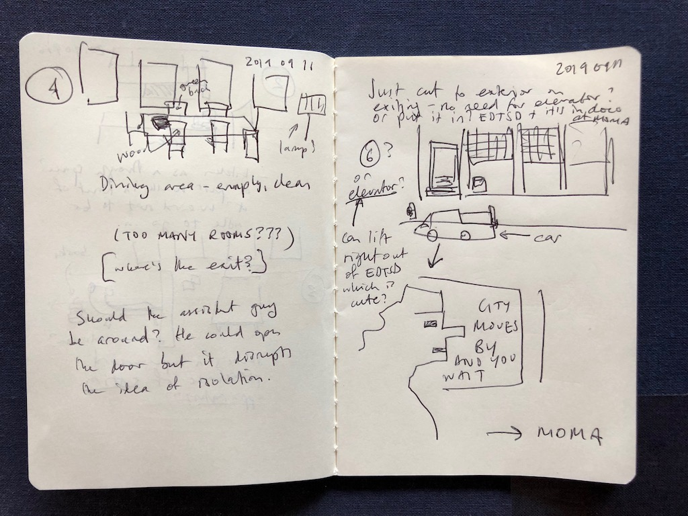
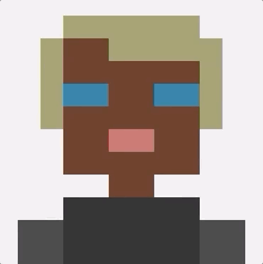
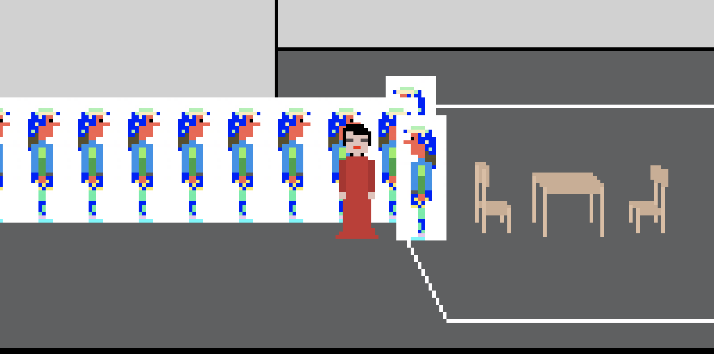
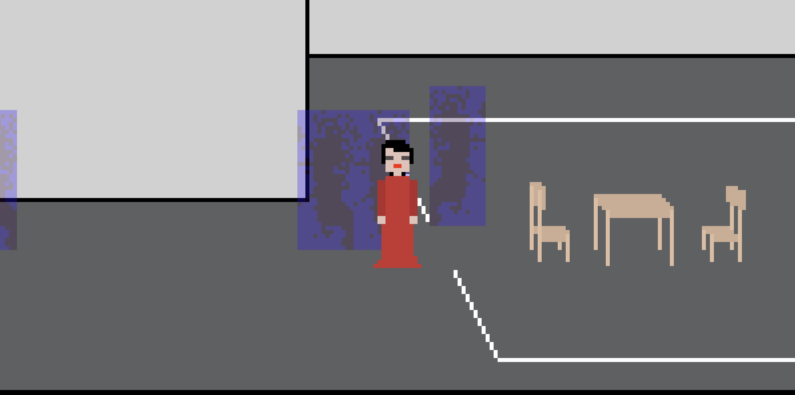
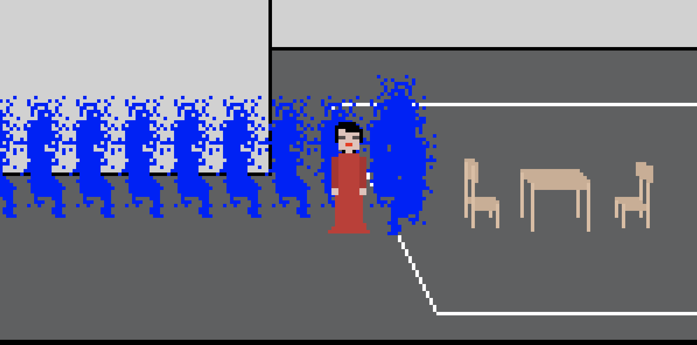
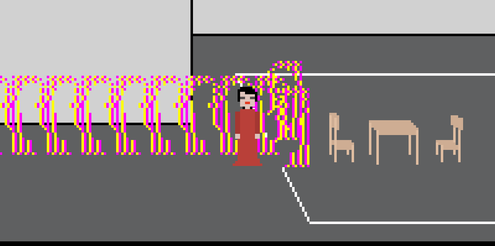
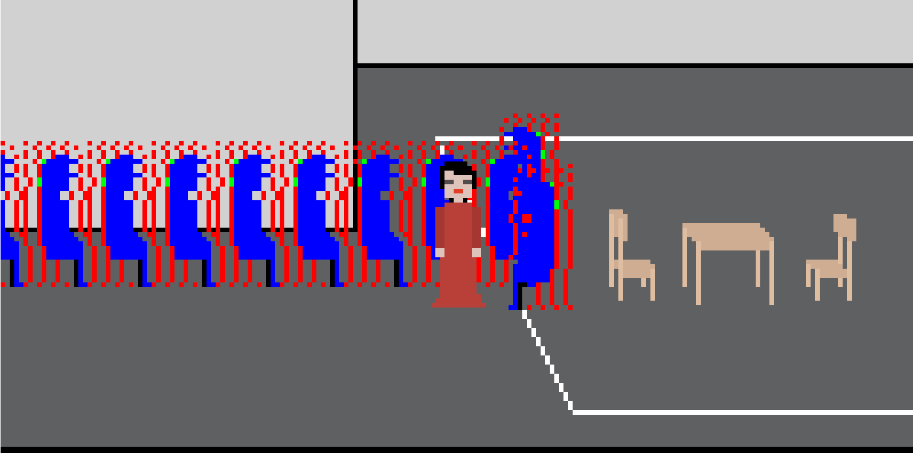
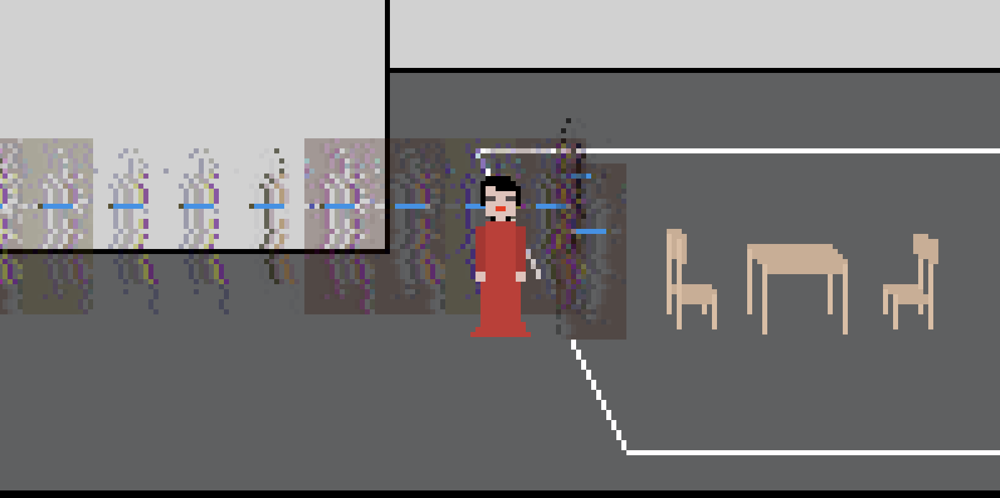

# Getting there, Sitting there, What is it about? (Wednesday, 21 August 2019, 14:44PM)

Okay then. I thought I would make a sequel to The Artist Is Present (the game) now, about nine years after I released the first one. Arguable the game that "made my name" or something along those lines. Still a game a bunch of people identify me with, having no conception that I made anything worthwhile after it. Ho ho.

The premise is simple. It's "the same game" but you're Marina instead of an audience member.

There are a bunch of decisions to be made chiefly around what it means to get to the performance, and then what the interface is like when you're in the performance.

## Getting there

I can think of a few gradations of detail here.

### You could just already be in the room right at the start of the game.

This wouldn't work at all though because it gives you no chance to embody your character as Marina, so it would just be disorienting and unclear.

### You could arrive at the museum just like an audience member (except earlier I suppose). Go in through the doors, say good morning to the people there, and then walk down the same hallways to get to your chair and sit down.

I like this one for mirroring the original game and lending a different feeling to the same actions that existed in that game. I guess I don't know how much I want to be referential to the original versus being authentic to the actual process by which Marina went to the performance? How authentic is this thing to be and in what ways?

In this version and any that don't have a changing room you'd already be in the red dress presumably, which I think would be nice and lend some humour to the experience.

### You could start at home and come to the museum from there (perhaps then cutting to the ideas in the previous one, so still coming the front doors etc.)

This was part of my vision for it when I was thinking of it a few days ago. In particular I wanted a kind of tribute to [Every Day the Same Dream](http://www.molleindustria.org/everydaythesamedream/everydaythesamedream.html). Start in the bedroom, go to the living room/kitchen, to the hallway with elevator (or stairs?), down to the street, into a car, arrive at MoMA, and carry on.

### I guess there's an ultra authentic version where I look at the footage available and try to actually recreate her path to MoMA and inside it, too

Which can work, too, but may not even be that rewarding. The authenticity isn't really meant to operate at the level of the architecture? Though I could certainly reference the actual apartment she was in (maybe a joke including passing through multiple living areas?) The ultra-authentic version would presumably involve dressing at the museum but I think it's too fun for her to dress at home.

### So something like

- Use reference images for EDTSD style sequence (in Sierra style art).
- Starts at home in bedroom.
- Maybe just by exiting she ends up in clothes. Otherwise by "using" the closet, but this raises the possibility of going naked, which is something else.
- Into living area. Maybe more than one.
- Kitchen area.
- Exit to hallway.
- Use elevator (if more referencing EDTSD), use stairs (if more referencing the actual apartment - also the hilarity of Sierra stairs).
- Street. Car waiting for her.
- Car takes her to MoMA. (Maybe a cut scene of being in the car for a set amount of time?)
- And from there follow the standard sequence. When you sit the queue forms? Or is it already there?

So yeah, question: is the queue already waiting and you arrive and sit and it begins, or there's no one, you sit, and then they come. There's something funnily vulnerable about there being nobody initially?

Also do I want to engage with questions of time this time? Or is it on "Marina time" so that when you get there, that's when it begins? I think I might prefer that?

## Sitting there

Until in the original game where sitting was the big reveal, here it's the majority of the experience I guess?

My thought is that it should simply bring up a blown up face of the person who sat down (literally scale it up) and that's it. They sit for however long they "want" to (match the timings of the original). THen they get up (maybe a nice tween) and you cut back to the main view and wait for the next one (head down). Maybe you choose when to raise your head actually, that would be nice. Will have to look at how I might include instructions for that kind of thing. (And actually if I do include an "action button" I could consider the wardrobe thing again - perhaps just not letting nude Marina leave since it's "not that kind of performance").

Honestly that bit doesn't sound all that incredibly difficult.

## So

There's a fair bit to think about clearly, and some new environments to create. I need to get Sierra-style-stuff working in Phaser3 (shouldn't be too bad given Eveline was in Phaser 2 I think).

Some open questions about authenticity of time and space.

Questions about interaction buttons and wardrobes.

## What is it about?

The key factor here is the question of what the game is "about", and I think it's about the experience of being Marina right? To which end I need to make decisions that focus on that. As such I don't think the time thing is at issue - we don't need to deal with concepts of her being "late" or whatever. It just starts when she sits. And lasts for however long it was meant to last (8 hours?).

The key is for the player to at some level build some identification with Marina as a brave/determined/lonely/independent figure (this being achieved through the sequence of arrival, which is probably why the apartment is so important). And then to identify with the act of endurance as almost secondary somehow, a matter of course, something you just do? Unsure what I mean by that, but it seems to me right now that the most important thing is settling into her role and then carrying it out to the best of your abilities?

More thought as it develops I suppose.

---

# The dress, queue chat, fatigue and the semester (Friday, 30 August 2019, 14:38PM)

## The dress

I've made some light progress on actually putting the game together. I now have a Marina-in-a-dress walking around in the atrium and it looks surprisingly good (if I may say so myself). The moment where I had her walking and it _felt_ like the dress was a good moment, it was one of those "maybe this whole game will work" things, so that was nice.

## Queue chat?

I'm realising as I type this that I've decided she's going to enter the museum the "normal" way? In which case she'll pass the queue as she goes down the hall. This gives an opportunity for them to turn and look at her and say things. And perhaps if you bump into them they can say generated fandom things to you, so there's a kind of actual feeling of the crowd there waiting to see you. That will add a bit of liveliness to the experience?

## Fatigue and the semester

I'm pretty aware I haven't been all that devoted to this project given that the new semester is starting and my time will start to seem smaller and bitsy for a while. Which is fine! But I'm signaling to myself not to freak out about productivity. I'll get stuff done on it over time and we'll get there. Ebbs and flows, my friend.

---

# Planning the scenes (Friday, 30 August 2019, 15:15PM)

Let's plan this thing scene by scene...

- __Bedroom__. At the start you're in bed, you can see that you're already wearing the dress (but maybe under the covers?). A message welcome you to the game and when you continue you pop out of the bed. (In EDTSD you start standing beside you bed with the alarm on.) I like this because although Marina is famous for doing naked things, it's not relevant here and Sierra-style avatars are _not_ good for depicting naked bodies and _especially_ not naked female bodies. I don't want to even try to go there. So she sleeps in her dress. It's kind of comical, maybe a little endearing? Wrong, obviously, too, but we're going for a spirit not exact matches with reality. So you're up and you can walk to the right to leave the bedroom. No interactive furniture or anything (and indeed ideally I think no interactions of any kind beyond triggering things through movement and dismissing dialogs with keys).

- __Lounge, Kitchen, Door__. There's a chance to have some fun depicting some of the weird contemporary furniture in the apartment she stayed in? I like the idea of drawing some representations of that space, there's something about it that's kind of sad and cold and depressing and I think her walking through it at some small length would be quite satisfying. The kitchen, too, is relatively iconic from the documentary with its green shelving in the back. Nothing to do here except walk all the way through of course. Can have a slanty wall with the exit door on it...

- __Stairs? Elevator?__. The real apartment has stairs and it would be kind of nice to stick with that, but it would require a special spritesheet? Or would it be plausible to do just dropping the existing sprite downward while moving forward? There's something nice about going down stairs in these games, it's quite satisfying? On the other hand, an elevator is what is in EDTSD and it's "easier" in some sense to implement? The doors could just open when you walk into the hall and close when you go in? Maybe an indicator changes from floor to floor? At the bottom you're in another hall which you leave to go outside? Got to think at least a little about the spatial correspondences? But some of this will be aided, I think, by splitting most of the spaces into separate scenes perhaps? (What about the museum?) Oddly this stairs/elevator issue is a challenge.

- __Car pickup__. After leaving the apartment you should end up on a street corner (with the building visible behind you?). A car pulls up and maybe they say your name or whatever, and you approach the car and automatically get in.

- __Car driving?__. Do we want any kind of interstitial of sitting in the car with the city rolling by? It would potentially be kind of meditative and nice, but might be weird to lose agency like that? There's a precedent in games like LSL though. Those tend to have a front-facing view (and kind of weirdly detailed?), whereas here I like the idea of just our face framed by a window with buildings going by?

- __MoMA__. From this point you're into the previous game's scenes, being dropped off in front of MoMA. So you go in, could say hi to ticket perhaps, to security guard. Then walk the halls, see the queue. The people talk about you or to you if you approach. You go all the way to the front (you can trangress the lines I suppose?). Security guard tells you some information about sitting down to start the day. You go near your chair and automatically sit, and then there are announcements from the guard, and people start coming to sit with you. For this I'll need to remember the queue of people or at least their spritesheets to generate the correct queue order for when you sit, but that could be as simple as generating the correct sprite keys into an array and rebuilding them in subsequent scenes as needed. Or maintaining the idea of the first game where MoMA is a single scene, that's fine too. Will still need at least some queue management stuff so that everyone moves up properly and so on, could be hell. Could be fine. I can do it.

- __Gazing__. You have your head down when the person sits (automatic or chosen?) and then once they sit you can choose the moment to look up (maybe with the up arrow, and the down to look down, which could signal you're ready). On looking up we fill the screen with just their (very zoomed in) pixel face. No blinking. You look they look, eventually they leave (raise the sprite a bit then cut to the room). Same process of looking down (maybe you choose), next person comes, you look up. On we go. Until the day is done, and then.... what? Should there be a reversal where you go home to bed? Funny? Or stupid? Maybe stupid. Maybe the museum closes and the game fades to black.

---

# Service, Inversion, Remediation (Monday, 16 September 2019, 16:36PM)

I wanted to take a moment to splat down a few thoughts about what this game is actually about, how it's meant to feel, etc. I've made some notes earlier, but it's always good to repeat yourself over and over again, right? People enjoy that.

## Service

One understanding I've come to of the game in my visualizations of how it would feel is that it's a game about "being in service" to the NPCs. You're Marina and to some extent it's your job to show up for them, to sit in your chair, to wait for them to sit, to look into their eyes, to pay attention to them, to care about them, to connect with them.

I think there are interesting tensions here in conversation with the original work: is the real performance about presence as service or is it also about a kind of ego, an emphasis of the importance of the artist, a flexing of fame and charisma, etc.?

To the extent there's that less "service-y" element to the real performance, something I think I like about the digital take is that the ego is doomed. You aren't sitting in front of real people, they don't _really_ care or admire you or think you're famous. And for that matter you (the player) _are not Marina Abramovic_ in the first place, so any actual sense of admiration would be not for you but for who you're pretending to be (since it's also based on history rather than present actions).

So in a way your actions need to be really selfless? That's what the game asks of you? Given that a) there's nobody (real) there to acknowledge your selfless actions (thereby ruining their selflessness?) and b) your actual self is not represented in the game, it's replaced by Marina. (This is making me wonder about character creation and the chance for it actually to be you? Like sports games but to feel like a super famous artist? Not unlike Art Game but perhaps with real correspondence to reality? See also: Donald Trump Alone in the Forest?)

It's kind of a more beautiful act because you're "ministering" to these digital characters who do want your attention (by definition and behaviour) but also can't really appreciate it (in a human sense)?

This angle emphasizes the importance of settling into the character, of taking some time to get there as it becomes a kind of pilgrimage? You need to be alone for a while, to become Marina in order to give yourself away to these figures.

The selfless angle makes me wonder a bit about the whole thing of having the NPCs express excitement about your arrival from the queue, but this I think must play into the experience because it's how the real people really felt (it's why they were there) and even if it perhaps emphasizes ego and self-hood, it perhaps create a nice contrast to the actual act, where all the vocal admiration would be gone and you're the only one "doing work" in the situation of looking at them?

## Inversion

Much less developed in my head, but it's obvious that this game is at least in part an exploration of inversion as a way of making a game - a specific kind of inversion obviously. I suppose it suggests the requirement of at least some kind of asymmetry in the roles available (and I suppose of there being two major roles). So you couldn't apply this logic to absolutely anything (though there's a parallel with something like Ball Pong in which you're the ball instead of the paddle).

It's a kind of a design tactic? It has a formal quality to it that could be reused (like hybrid game design with Jonathan).

## Remediation

I'm rereading Remediation (the book) at the moment for the first time in, well, probably more than ten years (so we might as well say I'm reading it for the first time). In essence as I'm taking it we can talk about

- Transparency (the idea of media trying to erase their presence)
- Hypermediacy (the idea of media that revel in their own presence and even exaggerate it)
- Remediation (the idea of one medium incorporating/redoing another medium)

I think you could probably talk about more traditional kinds of remediation in this game, most notably

- Remediation of the media/press coverage of the original show (after all I did a ton of research into it, relied on iconic imagery) - so a kind of remediation of the articles written about it, the photography taken (this makes me think in particular of the creation of the full-face image we'll have during the actual gazing and its reference point in the often-weeping faces of people who sat with her for real)
- Remediation of the documentary of the performance. Notably the perceived isolation of Marina in her task, surrounded by people, none of whom can really help her? But also the journey from the apartment to the sitting itself, particularly the austere/blank domesticity of the apartment she's in, which seems so uninviting and depressing at least in the small shots you get, and I suppose reemphasizes loneliness and isolation?

But really what I'd kind of like to be able to talk about is a more central idea of "remediation" which would be the remediation of the performance itself. I'm just not sure if I can say that, because is performance art a "medium"? I don't think it would be terrible to say so? Or that the body is a medium put more directly?

So maybe there's some mileage in this? It's a remediation of Marina's body (as in her medium of expression) and maybe the spaces around it (similarly) into the form of a digital game. And as such the remediation becomes an exploration of the possibilities, implications, negativities, advantages, connotations, denotations, and on and on around that basic premise. What does it mean and so on?

And what is the advantage to talking in these kinds of (scholarly) terms? Perhaps just that it allows me to explore the meanings of the game and its process in a kind of depth or from a particular perspective.

(That said, the book itself hasn't been all that helpful in suggesting actual strategies or tactics of analysis, not what the point of such analyses is, so who knows.)

---

# Notebook sketches of spaces (Monday, 16 September 2019, 17:35PM)

Some quick notes on what these sketches brought up (mostly just translating the text in them so it's more legible?):

- There's the continuing tension in terms of spatial layout, particularly a pure left to right idea (mirroring EDTSD as well as traditions from platformers, but also potentially more evocative of a pilgrimage?) versus a more authentic attempt to have a layout related to the actual apartment as depicted in the documentary. I think the compromise here is to sacrifice the layout but to maintain reference visually (furniture, windows, etc.) of the actual place. This means having doors in places they aren't, such as in the rightward wall of the bedroom, but that's fine....
- How to deal with the kitchen? It's a space that can be seen from the main living space, and isn't a through space? It absolutely has to be in the sequence if only because it's striking (very green) and also because EDTSD has a kitchen element. Maybe the answer is to only have the back wall of the kitchen featured so you just never deal with this? Maybe it can be the background to the dining table? That's another option.
- The "front door" will need to be the rightmost thing, and irritatingly I guess it just has to be open - it's not like we type "open door" or anything. Why is it open? Unclear.
- So many chairs, which is very fun and related to the work. Might be hard to render in this resolution
- Are there too many rooms? How many is too many? I want it to feel like something, so having a few is good.
- The big question of the exit - maybe just cut straight to exterior when she goes out the front door? Or maybe an elevator. Let's go with an elevator? A decision.
- And then the car is just a fun interstitial with nothing to do. You just wait. In fact it kiiiind of mirrors the sitting?

---

# Spaces spaces (Monday, 7 October 2019, 16:32PM)

I've built a bunch of stuff now. Drawn in Pixen, translated to Phaser, and including transitions between spaces, which is what I'm working on right at the moment.

For the moment, other than the audience and a couple of small things I think I have the full gamut of art assets which is a relief.

The kitchen still doesn't look as great as I'd like. Might need to rethink its representation? It's just not very convincing and its spatially confusing because you can't tell how it's organized in terms of where you can and can't walk. Might be better to have her just walk through the middle of it instead? Something where it's a bit lighter on options? It mostly needs to symbolize kitchen more than anything right? Hard to say.

Other than that I think the spaces looking pretty accurate and are a nice tribute to the apartment she really stayed in, as captured int he documentary at least.

I avoided all the elevator/stairs stuff for now by just going directly from the door out of the apartment to Marina walking out of the building down the stairs. It pretty much works fine I think.

Not a whole ton of process writing for all this because I've been working in fits and starts and it's really mostly assembly right now with very little interesting design stuff going on.

---

# Return of the sub-artist (Monday, 13 January 2020, 15:00PM)

It has __been a while__. Essentially at a certain point the Fall semester got all the way on top of me and it didn't feel possible to work on this game. Then I went to New Zealand for six weeks during which it was decidedly not reasonable to work on a game. Now I'm back in Montreal, a week into "bachelor" life, and thinking it would be good to recommit to and finish this project.

Let's be honest: I feel uninspired and uninterested in it right now. But it also seems like a project that is well-defined enough that I don't think I need inspiration. I just need work. And I'm prepared to do it. So bring it on.

---

# Feet wet (Tuesday, 14 January 2020, 13:11PM)

Dropping by to say that yesterday I did that thing of just working. In the end I spent it all just reworking the scene transitions by refactoring to create a game-specific Scene class that could handle that kind of stuff. After a relatively long (and not very interesting, but quite satisfying) tussle, it works as it should. Freeing me up to continue to progress with knitting the different scenes together. I'm tempted, as I write that, to make a fake exit from Exterior to MoMA and work on the car sequences later, since the former will be easier to do and gets me the whole space now, letting me choose more easily between the car sequence and the queue and so on. (Actually from memory the car sequence is ludicrously easy.) Also need a dialog system still at some point. La la.

---

# One long sinuous line, forcing the issue? (Saturday, 18 January 2020, 20:33PM)

Over course of the rest of the week I threaded together all the scenes needed for the game, made sitting down possible, and got a basic dialog box working. As such the whole thing is "connected" which has felt important.

Important, too, was that I think the car sequence felt meaningful, and also that being able to sit down and lower Marina's head was also quite evocative for me. So there were moments in there that seem to feel the way I wanted them to feel.

Big remaining things, quite obviously:
- Dialogs everywhere dialogs are needed (waking up, getting into the car, arriving at the museum, talking to ticket person, talking to security guard, painting information, talking to the queue, talking to security guards, instructions on raising/lowering head and protocol)
- The queue (needs to be there to begin with, needs to extend to second hall, someone needs to walk to the seat when head goes down, queue needs to move up, need to take on new (random) people each time it moves up to keep it constant)
- The looking (needs to display the correct face for a random authentic amount of time)
- Museum closing (I guess if anyone sat there for 8 hours we would have to end the game and ask them to come back tomorrow!)

A question: What do I think about a person who gets to the chair and then just leaves it running without looking at the people? Should there be some kind of parallel to the original game's queuing requirement? Or will it make the whole things artificial? I guess it could demand you don't press keys or move the mouse, freezing the game if so to demand you really pay attention and do your job? Or is it just a portal out of your computer and the game rolls along even if you're not there? May require some more thought when I get there.

---

# Crying, Blinking, Excited Whispering, The visitors are present? (Saturday, 1 February 2020, 17:14PM)

Looks like I haven't written anything here for longer than I intended. I think the idea of process journaling has fallen away from me a little just because of the break I took over Christmas, and the general exhaustion that it generates. My documentation of this project has just generally not been as good as it could have been. Will do better etc.

Since that last update I've done a lot of stuff, to the point where the end is "in sight" (but of course might still take weeks for reasons I don't know yet). In particular we have the full sequence through to looking at a queue of people moving through, we have dialogs, we have people who blink and potentially weep. There are a couple more things to add in (the excited whispering element of arriving is the most fiddly).

## Crying

The crying was an obvious addition that turned out a little better than expected. Initially when I implemented it it was way too fast and unsubtle, too symbolic perhaps:

But after reworking it to have more subtle timing and to have the rate of fall differ when the tear reaches the chin (e.g. it moves slower down your face, then falls more quickly) and to have tears start on the inside and outside, we get something much more "convincing":

Although this isn't something most players will likely see (it won't be every visitor and it won't trigger immediately or indefinitely), it's clearly emblematic of the original work, and that was always something I paid attention to in the original game, making it vital here to include it. It further emphasizes the overall concept of service, too - an explicit way of showing it being meaningful to the person in question.

## Blinking

Less emotionally dramatic, but important, is blinking. It breaks any illusion that the game has crashed or gone to sleep or is totally static. That's the only thing most people will do, but I think it's enough to active that experience.

I'm wondering, now, whether there's some way to more explicitly signal that idea that these people are going to stay as long as they want? It would be some small way to activate the player's "competitive waiting gland"?

## Excited whispering

The biggest remaining thing (beyond the obvious required tweaks and inevitable bugs) is the dialogs around you arriving into the space with the visitors/audience. Naturally they would be very, very excited to see you - the reason they're there after all, and no doubt they would say things! It feels appropriate to make this explicit

1. I feel like that's something Sierra games actually do (I believe in the car crash scene early in the first Police Quest there's something along those lines)
2. I feel like it's what _must_ have happened at the actual event. Or rather it _would_ have, as I'm going to guess Marina was already sitting there before they let people in.

## The visitors are present?

Given the various decisions I ended up making, when you arrive the people are already waiting. And I made it that way for a reason: most obviously so that you had a sense of the magnitutude of the occasion - though even now I'm questioning this... it doesn't have to be the case as we could also do a version where everyone runs in after you sit down, and then we wait until you lower your head. Shit... which is better?

My argument for them already being there is so you get to _see_ the crowd and hear them talk excitedly about you, and thus are drawn even further into this idea that you're important to them and that they want to be seen by you.

But if the game is about authenticity (still), then that's probably not what happened, so should I be including it? How powerful is the other version? Where you walk in and it tells you to sit so they can let people in? Further, where would all those people have been given that you came in the front door?

Well shit. Stupid design problems. I have to give this some actual thought.

Hmmm... well for one thing, let's be honest about the authenticity argument: it doesn't hold as much water as all that - even in the original game the spaces are a bit notional in the sense they evoke the museum rather than slavishly recreate it, so spatially at least it's not that. It was more procedural I suppose - the ideas of "go to the museum", and "wait in a line" were reproduced with a mind to make them register.

So in that sense, the fact that, for instance, Marina enters through the front of the gallery and the audience is already there, which aren't things that happened, are more about the symbolism of her arrival and are tied particularly into my desire to make this about service. You could say, actually, that without all the backstory and context of knowing about her fans' deep love/obsession, you can't really know the stakes of the work, and that walking past them and hearing them talking is a way of instilling that? And in that sense, it _is_ about one form of enhanced symbolism, because it allows you into the true story and cultural context of the work, rather than presenting the "truth" that will actually render it more opaque? Part of making a game about art (or any human experience) has to be a kind of scaffolding to bring in people who don't already understand the experience beforehand? (Which is basically everyone?) I know games don't actually do this (every shooting game ever), but it occurs to me right now that that's an important act.

Okay, so I think that actually makes the decision for now. I plow on with the original plan, but I remain aware of this tension and keep checking in.

---

# Almost done (Sunday, 9 February 2020, 10:08AM)

Reporting in to say the game is almost done. Have sent it over to Jim and Mary and Jim has looked at it a couple of times, finding an "interesting" bug in Firefox where the sprite recoloring didn't work because of sRGB for reasons I don't totally understand. Turns out that just saving the spritesheet with sRGB disabled was enough to solve the problem - it's some kind of color correction thing that Firefox takes into account and Chrome doesn't (or vice versa?). Anyway, disabling it meant the browsers all behaved the same (correct) way again.

Beyond that I've made pretty well all the decisions that needed making and implemented it all. The game runs from title to museum closing at the end of the day. The visitors queue up and come and sit and stare and blink and sometimes cry. I think it might be done?

Need one or two more quick tests probably just to see if someone can break it, but otherwise I imagine releasing it week after next so I've got time to whip up a press kit and write to some press types and so on. Unclear whether anyone will give any shits about the game, but it's been an effort and I feel it's substantial enough to want to notify people of its existence more extensively. It's a funny story to have made a sequel 9 years after the first game (probably even better if I'd left it another year for the full decade, but oh well I didn't).

I think I'm pretty happy with it at this point. I should play it straight through and see how it feels in total, but I think the underlying concept of service/role reversal is a nice one and its in there. If nothing else, the experience of a) being the focal point and then b) being confronted with staring low-resolution faces is pretty interesting.

So, almost there. Almost done.

---

# Queue Magic (Sunday, 9 February 2020, 12:55PM)

Just remembered I took a bunch of screenshots of the strange stuff that happened when I was messing with the recoloring code to try to make it work in Firefox. A lot of this is just me using specific values to try to understand what's going on. I never did, but the output is pretty great...

